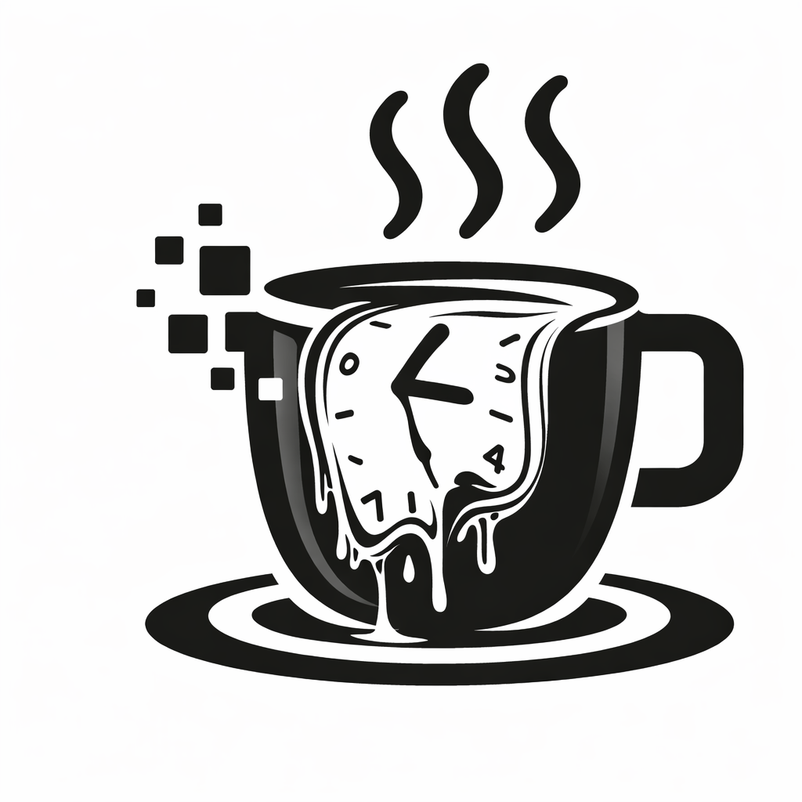
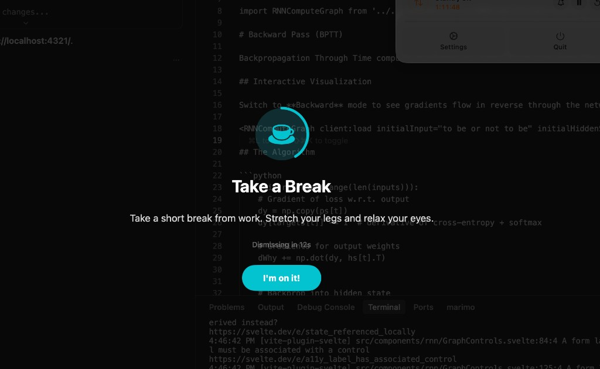
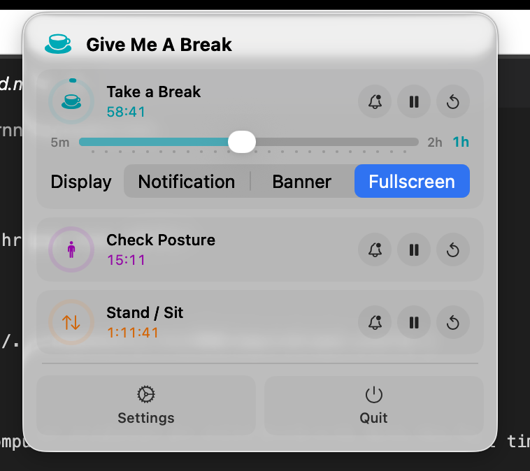

<p align="center">
  
</p>

<h1 align="center">Give Me A Break</h1>

<p align="center">
  <strong>A lightweight macOS menu bar app that reminds you to take breaks, fix your posture, and alternate between standing and sitting.</strong>
</p>

<p align="center">
  <a href="https://apps.apple.com/us/app/give-me-a-break-health-timer/id6759898658?mt=12"></a>
  <a href="https://github.com/jxucoder/give-me-a-break/releases/latest/download/GiveMeABreak.dmg"></a>
</p>

<p align="center">
  <a href="https://github.com/jxucoder/give-me-a-break/releases/latest"></a>
  <a href="https://github.com/jxucoder/give-me-a-break/blob/main/LICENSE"></a>
  
</p>

<p align="center">
  <a href="https://givemeabreak.app/">Website</a> &nbsp;&middot;&nbsp;
  <a href="https://github.com/jxucoder/give-me-a-break/releases">Changelog</a> &nbsp;&middot;&nbsp;
  <a href="https://givemeabreak.app/privacy.html">Privacy Policy</a>
</p>

<br>

<p align="center">
  
  &nbsp;&nbsp;
  
</p>

<br>

## Why?

Sitting at a desk all day is terrible for your body. Prolonged sitting increases risk of cardiovascular disease, chronic pain, and fatigue, even if you exercise regularly. The fix is simple: take short breaks, check your posture, and switch positions throughout the day.

**Give Me A Break** lives in your menu bar and quietly reminds you to do all three.

## What It Does

| Reminder | What it does |
|---|---|
| **Take a Break** | Reminds you to step away from the screen, rest your eyes, and stretch |
| **Check Posture** | Nudges you to sit up straight, relax your shoulders, and unclench your jaw |
| **Stand / Sit** | Prompts you to alternate between standing and sitting at your desk |

Each reminder runs on its own independent timer (5 min to 2 hours). Visual progress rings show how much time remains at a glance. Pause, reset, or adjust any of them directly from the menu bar.

## Install

### Mac App Store

<a href="https://apps.apple.com/us/app/give-me-a-break-health-timer/id6759898658?mt=12">Get it on the Mac App Store</a>

### Direct Download

Download the latest [GiveMeABreak.dmg](https://github.com/jxucoder/give-me-a-break/releases/latest/download/GiveMeABreak.dmg), open it, and drag the app to your Applications folder.

The direct download version checks for updates automatically via [Sparkle](https://sparkle-project.org/).

### Build from Source

```bash
git clone https://github.com/jxucoder/give-me-a-break.git
cd give-me-a-break/GiveMeABreak
xcodebuild -scheme GiveMeABreak -configuration Release
```

Or open `GiveMeABreak/GiveMeABreak.xcodeproj` in Xcode and hit Run.

Requires macOS 14 (Sonoma) or later and Xcode 16+.

## Features

| Feature | Details |
|---|---|
| Three independent timers | Break, Posture, Stand/Sit with individual intervals and controls |
| Visual progress rings | Color-coded indicators show time remaining at a glance |
| Menu bar controls | Pause, resume, reset, and adjust intervals without leaving your workflow |
| Flexible display modes | Notification, banner, or fullscreen overlay per reminder |
| Smart notifications | macOS notifications with snooze options (5, 10, or 15 min) |
| AI messages | Optional on-device Apple Intelligence for varied reminder text (macOS 26+) |
| Auto-updates | Built-in Sparkle updater (direct download version) |
| Launch at login | Start automatically with your Mac |
| Privacy-first | No accounts, no tracking, no data collection |

## Settings

Open **Settings** from the menu bar dropdown:

- **General** — Launch at login, notification sounds, overlay duration, check for updates
- **Reminders** — Enable/disable each reminder, set intervals, choose display mode
- **AI Messages** — Enable Apple Intelligence, pick a tone, or write a custom prompt

## Privacy

Give Me A Break does not collect any data. All settings are stored locally. The only network request the direct download version makes is checking for updates via the [appcast feed](https://givemeabreak.app/appcast.xml). AI-generated messages are processed entirely on-device using Apple's Foundation Models framework.

## License

[Apache License 2.0](LICENSE)
